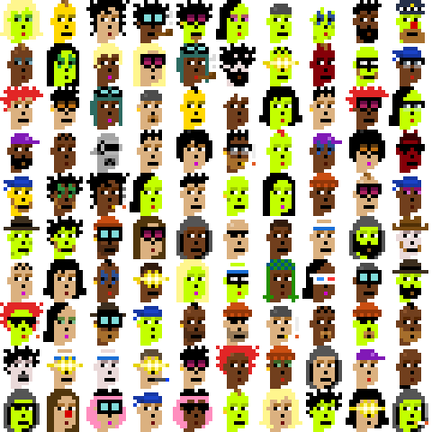
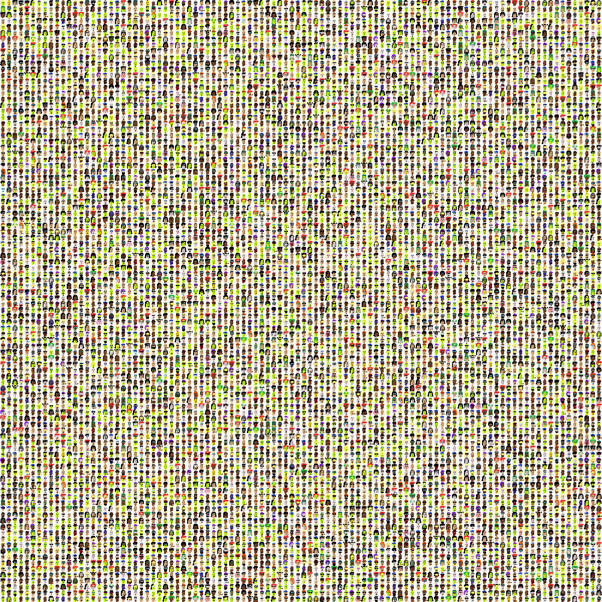

Looking for the Bitscoin Edition?  See [Punks 12px @ orc721 »](https://github.com/orc721/punks12px) 


# Punks 12px, The Ethscribe Edition  -  Self inscribing, First is first

10000 unique punks, colorful 12x12 pixel art. Long ethscribes, Long punks!

 


## Intro

Let's generate 10000 punks (12×12px) in a reference edition.

Find all 10000 reference images one-by-one in 12×12px in [**/ethscribe**](ethscribe):


...


Find all meta data in the [punks12px.csv](punks12px.csv) tabular dataset e.g.

```
id, type, attributes
0, Green Female, Earring / Blonde Bob / Green Eye Shadow
1, Gold, Mohawk
2, Female 3, Wild Hair
3, Male 1, Wild Hair / Pipe / Nerd Glasses
4, Green, Goat / Earring / Wild Hair / Big Shades
5, Green Female, Earring / Half Shaved / Purple Eye Shadow
6, Green, Do-rag
7, Green Female, Spots / Wild White Hair / Clown Eyes Blue
8, Male 1, Luxurious Beard / Messy Hair
9, Green, Big Beard / Police Cap / Clown Nose
...
```


### Popularity & Rarity by Types 

|  Type                                   | Pop             |
|-----------------------------------------|----------------:|
|  Alien               |    9  ( 0.09 %)  |
|  Red                   |   15  ( 0.15 %)  |
|  Aqua                 |   17  ( 0.17 %)  |
|  Purple             |   19  ( 0.19 %)  |
|  Ape                   |   24  ( 0.24 %)  |
|  Purple Female |   53  ( 0.53 %)  |
|  Bot                   |   57  ( 0.57 %)  |
|  Red Female     |   58  ( 0.58 %)  |
|  Demon               |   59  ( 0.59 %)  |
|  Blue Female   |   59  ( 0.59 %)  |
|  Skeleton         |   69  ( 0.69 %)  |
|  Orc                   |   69  ( 0.69 %)  |
|  Zombie             |   80  ( 0.80 %)  |
|  Blue                 |  156  ( 1.56 %)  |
|  Gold                 |  198  ( 1.98 %)  |
|  Female 4          |  418  ( 4.18 %)  |
|  Male 4              |  557  ( 5.57 %)  |
|  Green Female | 1033  (10.33 %)  |
|  Female 1          | 1089  (10.89 %)  |
|  Female 3          | 1130  (11.30 %)  |
|  Male 1              | 1410  (14.10 %)  |
|  Green               | 1710  (17.10 %)  |
|  Male 3              | 1711  (17.11 %)  |


### Bonus - All together now

Find the composite fam image of all 10000 in a 100×100 grid in [punks12px.png](punks12px.png) (~360k - 1200×1200px).




## Builders Corner - Yes, You Can

For reference find all (generative) attributes (base types and accessories) in 12×12px in [**/attributes @ cryptopunksnotdead/punks.mini »**](https://github.com/cryptopunksnotdead/punks.mini/tree/master/attributes).

Yes, you can regenerate this punks 12px set 
using the generate_meta script
and using the generate script to generate all images
from the tabular dataset.


## Questions? Comments?


Join us in the Ethscription discord server. Yes you can.
Your questions and commentary welcome.

Or post them over at the [Help & Support](https://github.com/geraldb/help) page. Thanks.

