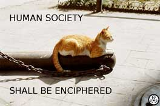

# Calldata Coders & Helpers

calldata - Calldata.encode / Calldata.decode using utf8_to_hex and hex_to_utf8 helpers and more for inscriptions / inscribes for ethereum & co


* home  :: [github.com/0xCompute/ethscribe](https://github.com/0xCompute/ethscribe)
* bugs  :: [github.com/0xCompute/ethscribe/issues](https://github.com/0xCompute/ethscribe/issues)
* gem   :: [rubygems.org/gems/calldata](https://rubygems.org/gems/calldata)
* rdoc  :: [rubydoc.info/gems/calldata](http://rubydoc.info/gems/calldata)


## What's Ethscription Calldata - Ethereum Inscription / Inscribe?!

See [Introducing Ethscriptions - A new way of creating and sharing digital artifacts on the Ethereum blockchain using transaction calldata »](https://medium.com/@dumbnamenumbers/introducing-ethscriptions-698b295d6f2a)


## Usage


Let's start with the Calldata encode/decode helpers.
In an inscribe the data gets encoded in the the calldata (hexdata notes) of a transaction.
The calldata is a binary blob. 
Note: This gem uses hexstrings for binary blobs.

Option 1: Use the "low-level" global `utf8_to_hex` and `hex_to_utf8` helper methods:

```ruby
require 'calldata'

hex = utf8_to_hex( "Hello, World!" )
#=>  "48656c6c6f2c20576f726c6421"
utf8 = hex_to_utf8( "48656c6c6f2c20576f726c6421" )
#=>  "Hello, World!"

hex = utf8_to_hex( "data:image/png;base64,..." )
#=>  "646174613a696d6167652f706e673b6261736536342c2e2e2e"
utf8 = hex_to_utf8( "646174613a696d6167652f706e673b6261736536342c2e2e2e" )
#=>  "data:image/png;base64,..."
```

Option 2: Use the `Calldata` module helper methods `encode/encode_utf8` and `decode/decode_hex`:

``` ruby
hex = Calldata.encode( "Hello, World!" )
#=>  "48656c6c6f2c20576f726c6421"
utf8 = Calldata.decode( "0x48656c6c6f2c20576f726c6421" )
#=>  "Hello, World!"

hex = Calldata.encode( "data:image/png;base64,..." )   
#=>  "646174613a696d6167652f706e673b6261736536342c2e2e2e"
utf8 = Calldata.decode( "0x646174613a696d6167652f706e673b6261736536342c2e2e2e" )    
#=>  "data:image/png;base64,..."
```

Note: The `hex_to_utf8` helper (incl. `Calldata.decode`) 
works with or without leading `0x` in  hexstrings.


### Data URIs / URLs


Let's continue with the built-in data uri/url machinery.
A valid inscribe must use a valid data uri/url in the calldata.

The "useless" (null) minimum is:

``` ruby

data_uri = "data:,"

Calldata.valid_data?( data_uri )  
#=> true
data = Calldata.parse_data( data_uri )    # returns a Calldata::Text object
data.type #=> "text/plain"
data.text #=> ""
```

Let's try the (genesis) inscribe no. 0:

``` ruby
data_uri = "data:image/jpeg;base64,/9j/4AAQSkZJRgABAgAAZABkAAD/7AARRHV..."

Calldata.valid_data?( data_uri )  
#=> true
data = Calldata.parse_data( data_uri )   # returns a Calldata::Blob object 
data.type #=> "image/jpeg"
data.blob #=> <blob>
## let's save the jpeg image (blob)
data.write( "0.jpeg" )
```

and voila!




Let's try the inscribe no. 15:

``` ruby
data_uri = "data:image/png;base64,/9j/4gxYSUNDX1BST0ZJTEUAAQEAAAxITGlubwIQAAB..."

Calldata.valid_data?( data_uri )  
#=> true
data = Calldata.parse_data( data_uri )    # returns a Calldata::Blob object 
data.type  #=> "image/png"
data.blob  #=> <blob>
## let's save the png image (blob)
data.write( "15.png" )
```

and voila!


Let's try a (structured) protocol message inscribe:

``` ruby
data_uri = %Q<data:,{"p":"erc-20","op":"mint","tick":"eths","id":"16888","amt":"1000"}>


Calldata.valid_data?( data_uri )  
#=> true
data = Calldata.parse_data( data_uri )    # returns a Calldata::Msg object 
data.type     #=> "application/json"  
data['p']     #=> "erc-20"
data['op']    #=> "mint"
data['tick']  #=> "eths"
data['id']    #=> "16888"
data['amt']   #=> "1000"
```

or use the convenience all-in-one `parse_hex` helper:


``` ruby
hex  = "0x646174613a2c7b2270223a226572632d3230222c226f70223a226d696e74222c227469636b223a2265746873222c226964223a223136383838222c22616d74223a2231303030227d"

data = Calldata.parse_hex( hex )    # returns a Calldata::Msg object 
data.type     #=> "application/json"  
data['p']     #=> "erc-20"
data['op']    #=> "mint"
data['tick']  #=> "eths"
data['id']    #=> "16888"
data['amt']   #=> "1000"
```


That's it for now.


## Bonus - More Blockchain (Crypto) Tools, Libraries & Scripts In Ruby

See [**/blockchain**](https://github.com/rubycocos/blockchain) 
at the ruby code commons (rubycocos) org.


## Questions? Comments?

Join us in the [0xCompute discord (chat server)](https://discord.gg/3JRnDUap6y) 
(or in the more general Ethscription discord). 
Yes you can.
Your questions and commentary welcome.

Or post them over at the [Help & Support](https://github.com/geraldb/help) page. Thanks.

