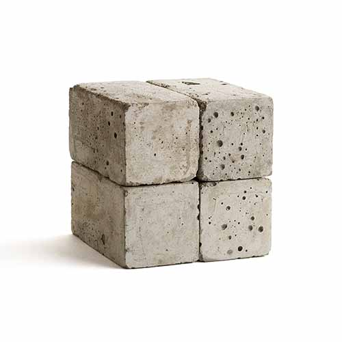

# Data URI Helpers

datauris - helpers to parse (decode) and build (encode) data uris incl. (strict) base64-encoded/decoded images and more

* home  :: [github.com/s6ruby/rubidity](https://github.com/s6ruby/rubidity)
* bugs  :: [github.com/s6ruby/rubidity/issues](https://github.com/s6ruby/rubidity/issues)
* gem   :: [rubygems.org/gems/datauris](https://rubygems.org/gems/datauris)
* rdoc  :: [rubydoc.info/gems/datauris](http://rubydoc.info/gems/datauris)


## What are Data URIs?!

Data URI Syntax via [Wikipedia](https://en.wikipedia.org/wiki/Data_URI_scheme):

> The syntax of data URIs is defined in [Request for Comments (RFC) 2397](https://datatracker.ietf.org/doc/html/rfc2397), 
> published in August 1998, and follows the URI scheme syntax. A data URI consists of:
>
>     data:[<mediatype>][;base64],<data>
> 
> -  The **scheme**, `data`. It is followed by a colon (`:`).
> -  An optional **media type**. The media type part may include one or more parameters,
>    in the format `attribute=value`, separated by semicolons (`;`). 
>    A common media type parameter is charset, specifying the character 
>    set of the media type, where the value is from the IANA list of character set names.
>    If one is not specified, the media type of the data URI is assumed 
>    to be `text/plain;charset=US-ASCII`.
> -  An optional **base64 extension** `base64`, separated from the preceding part by a semicolon.
>    When present, this indicates that the data content of the URI is binary data, encoded in ASCII format using the Base64 scheme for binary-to-text encoding.
>    The base64 extension is distinguished from any media type parameters 
>    by virtue of not having a `=value` component and 
>    by coming after any media type parameters. 
> -  The **data**, separated from the preceding part by a comma (`,`). 
>    The data is a sequence of zero or more octets represented as characters. 
>    The comma is required in a data URI, even when the data part has zero length. 
>    The characters permitted within the data part include ASCII upper 
>    and lowercase letters, digits, and many ASCII punctuation and special characters. 
>    Note that this may include characters, such as colon, semicolon, 
>    and comma which are delimiters in the URI components preceding the data part. 
>    Other octets must be percent-encoded. If the data is Base64-encoded, 
>    then the data part may contain only valid Base64 characters. 
>    Note that Base64-encoded data: URIs use the standard Base64 character set 
>    (with `+` and `/` as characters 62 and 63) 
>    rather than the so-called "URL-safe Base64" character set.


## Usage

[Parse](#parse) • [Build](#build)

### Parse


Let's try and parse the Wikipedia Data URI examples:

``` ruby
uri = "data:text/vnd-example+xyz;foo=bar;base64,R0lGODdh"
DataUri.valid?( uri )  
#=> true
data, mediatype = DataUri.parse( uri )    ## returns 1) data, 2) mediatype (+parameters)
#=> "<blob>", "text/vnd-example+xyz;foo=bar"

uri = "data:text/plain;charset=UTF-8;page=21,the%20data:1234,5678"
DataUri.valid?( uri )  
#=> true
data, mediatype = DataUri.parse( uri )    ## returns 1) data, 2) mediatype (+parameters)
#=> "the data:1234,5678", "text/plain;charset=UTF-8;page=21"


uri = "data:image/jpeg;base64,/9j/4AAQSkZJRgABAgAAZABkAAD/"
DataUri.valid?( uri )  
#=> true
data, mediatype = DataUri.parse( uri )    ## returns 1) data, 2) mediatype (+parameters)
#=> "<blob>", "image/jpeg"
```


Let's try the DataUri helpers on inscriptions (that encode the "on-chain" data 
in Data URIs). A valid inscribe must use a valid data uri in the calldata.

The "useless" (null) minimum - no media-type, and zero-length data - is:

``` ruby
uri = "data:,"

DataUri.valid?( uri )  
#=> true
data, mediatype = DataUri.parse( uri )    ## returns 1) data, 2) mediatype (+parameters)
#=> "", ""
```

Let's try the (genesis) inscribe no. 0:

``` ruby
uri = "data:image/jpeg;base64,/9j/4AAQSkZJRgABAgAAZABkAAD/7AARRHV..."

DataUri.valid?( uri )  
#=> true
data, mediatype = DataUri.parse( uri )    ## returns 1) data, 2) mediatype (+parameters)
#=> "<blob>", "image/jpeg"

## let's save the jpeg image (blob)
write_blob( "0.jpeg", data )
```

and voila!


Let's try the inscribe no. 15:

``` ruby
uri = "data:image/png;base64,/9j/4gxYSUNDX1BST0ZJTEUAAQEAAAxITGlubwIQAAB..."

DataUri.valid?( uri )  
#=> true
data, mediatype = DataUri.parse( uri )    ## returns 1) data, 2) mediatype (+parameters)
#=> "<blob>", "image/png"

## let's save the png image (blob)
write_blob( "15.png", data )
```

and voila!




### Build

Let's build Data URIs.

```ruby
uri = DataUri.build( "" )
#=> "data:,"

uri = DataUri.build( "the data:1234,5678", "text/plain" )
#=> "data:text/plain,the%20data:1234,5678"

# let's try images
data = read_blob( "0.jpeg" )
uri = DataUri.build( data, "image/jpeg" )
#=> "data:image/jpeg;base64,/9j/4AAQSkZJRgABAgAAZABkAAD/7AARRHV..."

data = read_blob( "15.png" )
uri = DataUri.build( data, "image/png" )
#=> "data:image/png;base64,/9j/4gxYSUNDX1BST0ZJTEUAAQEAAAxITGlubwIQAAB..."
```


That's it for now.


## Bonus - More Blockchain (Crypto) Tools, Libraries & Scripts In Ruby

See [**/blockchain**](https://github.com/rubycocos/blockchain) 
at the ruby code commons (rubycocos) org.


## Questions? Comments?

Join us in the [0xCompute discord (chat server)](https://discord.gg/3JRnDUap6y) 
(or in the more general Ethscription discord). 
Yes you can.
Your questions and commentary welcome.

Or post them over at the [Help & Support](https://github.com/geraldb/help) page. Thanks.

